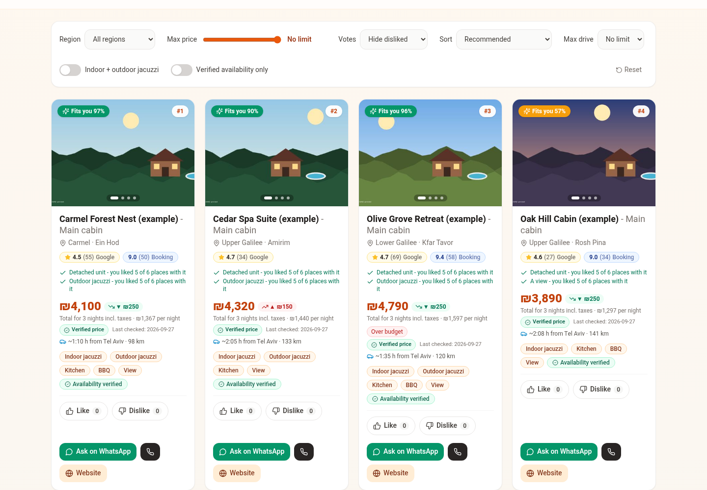
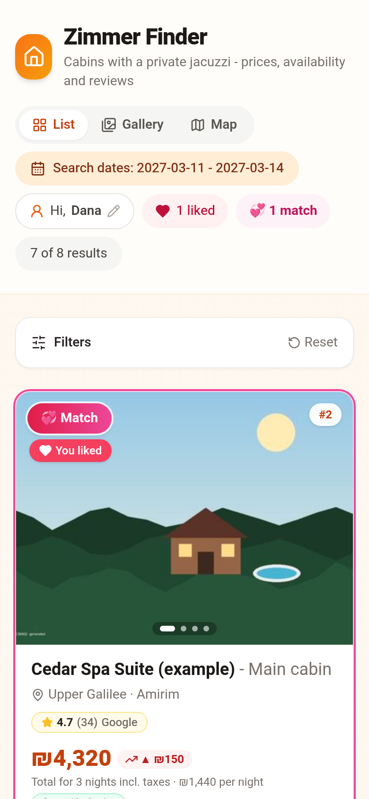
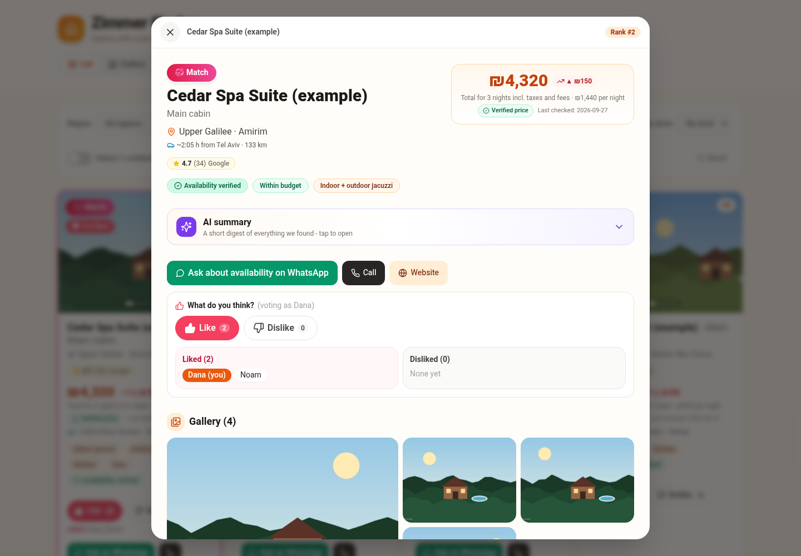
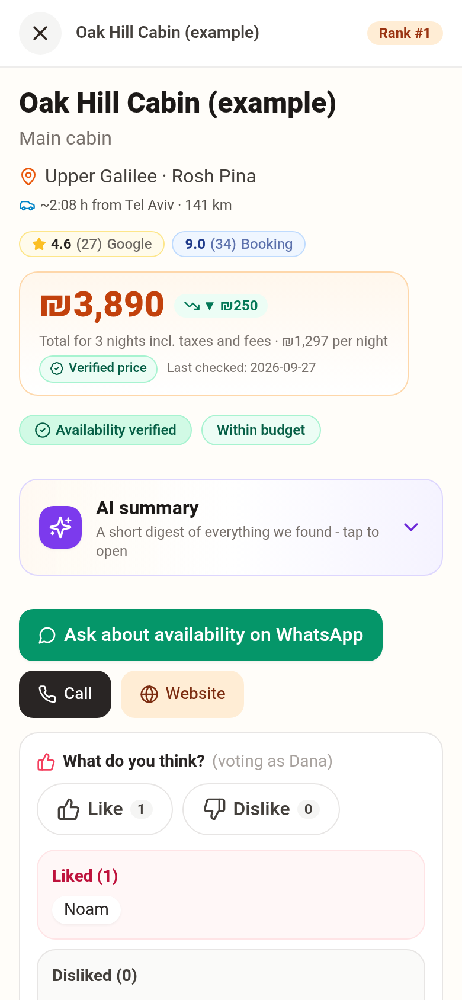
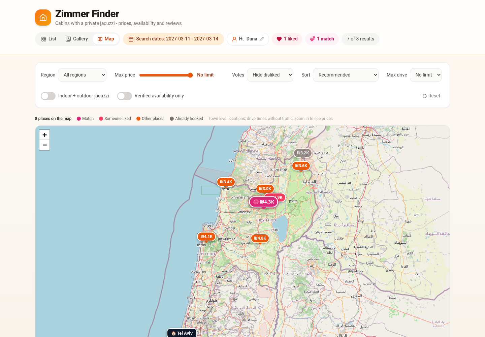
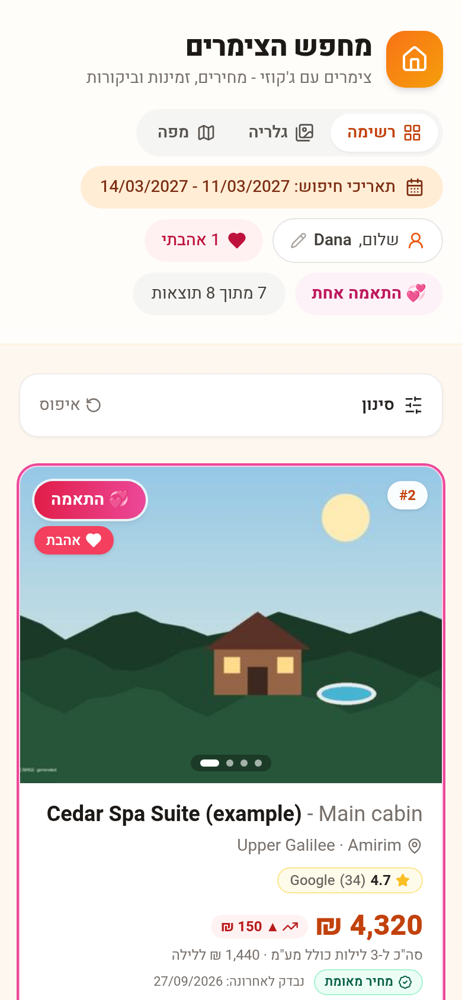
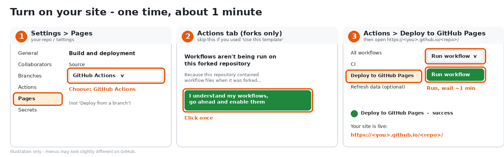
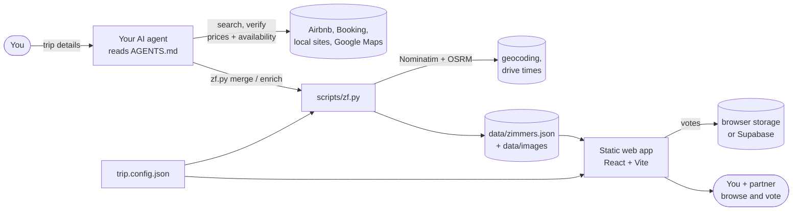
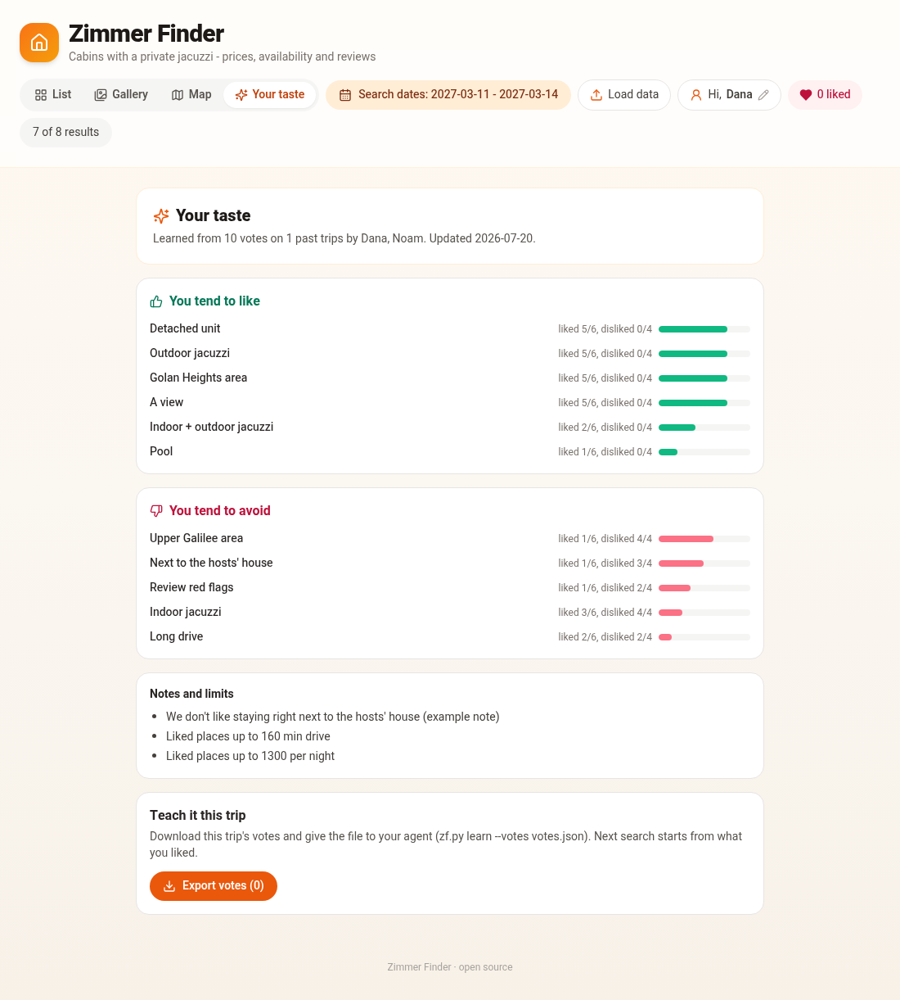
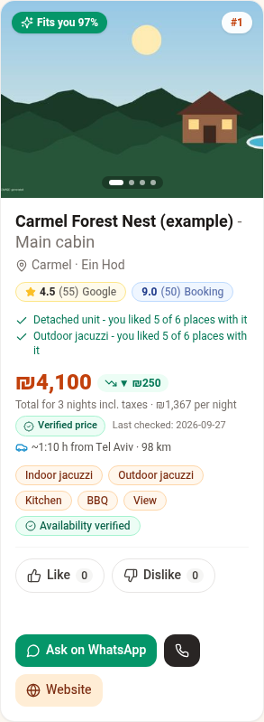

# Zimmer Finder

**Let your AI agent find the cabin. You and your partner just swipe and vote.**

Zimmer Finder is an open-source, agent-agnostic toolkit for finding a vacation rental (a *zimmer*, cabin or
villa) for exact dates, budget and must-haves. Any AI agent that can browse and run commands (Claude Code,
Cursor, Codex, ChatGPT, Grok Bot, Gemini CLI ...) follows [`AGENTS.md`](AGENTS.md) to search the web,
verify prices and availability, and write the results to a JSON file. A fast static web app shows them with
photos, reviews, a map, drive times and couple voting.

No backend, no account and no API key needed. Deploy free on GitHub Pages or just run it locally.

| Desktop | Mobile |
| --- | --- |
|  |  |
|  |  |
|  |  |

<sub>Screenshots use the bundled **fake example data** and generated images.</sub>

## Features

- **Cards with photo carousels**, a detail page, a gallery and a full-screen photo feed (swipe for the next
  photo, double-tap a side to jump to the next or previous place, swipe up for details).
- **Prices you can trust**: final total for your dates, per night, verified / estimated chip, last checked
  date and price history arrows.
- **Reviews at a glance**: Google, Booking and Airbnb rating badges, a guest summary and red flags.
- **Couple voting**: like / dislike with a display name, "match" when two people liked it, dislikes hidden.
- **Map** (Leaflet + OpenStreetMap) with drive times from your home town (OSRM, no traffic).
- **Filters and sorting**: region, max price, max drive, indoor + outdoor jacuzzi, verified only.
- **Learns your taste across trips**: votes become a preference profile (`data/preferences.json`). Next
  trip, every place gets a "Fits you" score with reasons ("Detached unit - you liked 5 of 6 places with
  it"), you can sort by fit, and the **Your taste** page shows what was learned.
- **New** badges since your last visit and a **sold out** section.
- **One tap WhatsApp** with a ready-made availability question (you send it, the agent never does).
- **English and Hebrew (RTL)**, any currency, one config file.

## Quick start

1. **Copy the repo** - click **Use this template > Create a new repository** (recommended: Actions work
   right away). A fork also works, but forks start with Actions and Pages turned off. Then
   [turn on your site](#turn-on-your-site-one-time-about-1-minute) once.
2. **Tell your agent** (any agent, in your fork or with the repo link):
   > Read AGENTS.md and find us a zimmer for next weekend, 2 adults, budget 2000, and give me the app link.
3. **Open the link** the agent gives you and vote with your partner.

The agent turns your request into `trip.config.json`, searches, validates `data/zimmers.json`, and must end
with an app you can open ([Definition of done](AGENTS.md#definition-of-done-read-this-first)), using the
first delivery path it can:

| Agent can... | You get |
| --- | --- |
| push to your repo | your own site: `https://<you>.github.io/zimmer-finder/` (GitHub Pages, deployed by the included workflow) |
| run commands only | one file, `zimmer-finder.html` (`npm run bundle`): double-click, works offline |
| only chat | a `zimmers.json` to open in the hosted viewer: [inonalfa.github.io/zimmer-finder](https://inonalfa.github.io/zimmer-finder/) > **Load data** (or a `?data=<raw-url>` link) |

### Turn on your site (one time, about 1 minute)

Without this step your `https://<you>.github.io/<repo>/` link shows **404**.



1. **Settings > Pages > Build and deployment > Source: GitHub Actions** (not "Deploy from a branch").
2. **Forks only:** open the **Actions** tab and click **I understand my workflows, go ahead and enable them**.
3. **Actions > Deploy to GitHub Pages > Run workflow**, wait about a minute for the green check, then open
   `https://<you>.github.io/<repo>/`.

After that every push to `main` (for example by your agent) redeploys the site automatically. With the
GitHub CLI: `gh api -X POST repos/<you>/<repo>/pages -f build_type=workflow && gh workflow run deploy.yml`.

Want to see it first? Open the [live demo](https://inonalfa.github.io/zimmer-finder/) with example data,
or run `npm install && npm run dev`.

## How it works



| Piece | Default | Optional |
| --- | --- | --- |
| Data | `data/zimmers.json` (JSON file in the repo), or any JSON via **Load data** / `?data=<url>` | Base44 entity ([integrations/base44](integrations/base44)) |
| Votes | browser `localStorage` | Supabase free tier ([docs/votes-supabase.md](docs/votes-supabase.md)), Base44 |
| Hosting | GitHub Pages, one offline HTML file (`npm run bundle`), or `npm run dev` | Netlify, Vercel, Cloudflare Pages, any static host (`npm run build` > `dist/`) |
| Recurring checks | your agent's scheduler | `.github/workflows/refresh.yml` cron for the scripts |

## It remembers what you like



Example: in **March** you search for a weekend in the Galilee. You both vote: you like the detached cabins
with an outdoor jacuzzi, and dislike two rooms right next to the hosts' house. The agent runs
`zf.py learn` and `zf.py archive`.

In **July** you ask for "a zimmer for our anniversary". The agent reads `data/preferences.json` first and
says: "From your past trips I assumed: detached unit, outdoor jacuzzi, a view, not next to the hosts' house.
Say if this trip is different." The new results open with a "Fits you" score and the reasons:



How it learns: for every feature (indoor / outdoor jacuzzi, view, pool, detached, next to the hosts, region,
red flags, long drive, ...) it compares how often it appears in places you liked vs places you disliked,
with add-one smoothing so one vote does not decide everything (`weight = ln(P(f|like) / P(f|dislike))`,
clipped to [-2, 2]). It keeps a profile for the two of you together and one per voter. You can always
tell it directly: `zf.py learn --feature pool --weight 1.5 --note "We want a pool"`. Everything stays in
your repo; nothing is sent anywhere.

The demo ships a fake past trip (`data/trips/2026-07-golan-example/`) and the profile learned from it.
`zf.py clear-example --yes` removes both.

## Configuration

Everything lives in [`trip.config.json`](trip.config.json) (validated by
[`schema/trip.config.schema.json`](schema/trip.config.schema.json)):

```jsonc
{
  "app": { "title": { "en": "Zimmer Finder", "he": "מחפש הצימרים" }, "locale": "en", "currency": "ILS" },
  "trip": { "check_in": "2027-03-11", "check_out": "2027-03-14", "adults": 2, "children": 0 },
  "budget": { "max_total": 4500 },
  "origin": { "name": "Tel Aviv", "lat": 32.0853, "lng": 34.7818 },  // drive times are from here
  "region": { "country": "Israel", "country_code": "IL", "phone_country_code": "972", "mobile_prefixes": ["5"],
              "areas": ["Upper Galilee", "Golan Heights"], "map_center": [32.9, 35.4], "map_zoom": 8 },
  "must_have": ["private jacuzzi", "kitchen or kitchenette"],
  "nice_to_have": ["BBQ", "view"],
  "storage": { "data": { "adapter": "json" }, "votes": { "adapter": "local" } }
}
```

Set `"locale": "he"` for a Hebrew right-to-left UI, or add `?lang=he` / `?lang=en` to the URL.

## Scripts

`scripts/zf.py` is a small, dependency-free CLI (Python 3.10+; `pip install pillow` for thumbnails):

| Command | Does |
| --- | --- |
| `merge new.json` | add or update records, dedupe by slug / listing URL / phone + town + unit |
| `validate` | check `data/zimmers.json` and the config against the JSON Schemas |
| `geocode`, `drive` | town coordinates (Nominatim, 1 req/s) and drive time from origin (OSRM) |
| `images [--slug S]` | download photos to `data/images/<slug>/` and make 480px thumbnails |
| `price SLUG TOTAL [--source booking]` | record a checked price and append price history |
| `sold-out SLUG...` / `available SLUG...` | availability changes |
| `rank`, `list`, `enrich` | default ranking, a quick table, or geocode + drive + images + rank + validate |
| `learn [--votes F \| --from-store] [--feature F --weight W --note T]` | learn the taste profile from votes on all trips (plus explicit notes) |
| `taste [--voter NAME]` | print what the profile learned |
| `rank [--voter NAME]` | default ranking, plus `fit_score` / `fit_reasons` when a profile exists |
| `archive [--votes F]` | move the finished trip to `data/trips/<name>/` |
| `clear-example --yes` | remove the fake demo data (records, past trip, taste profile) |

`npm run bundle [-- --data file.json --thumbs-only]` builds `dist-single/zimmer-finder.html` with the app, data and photos inside.

## Development

```bash
npm run dev        # dev server with hot reload
npm run check      # ESLint + Vitest + Python unittest + data validation + production build
npm run format     # Prettier
```

See [CONTRIBUTING.md](CONTRIBUTING.md) for the repo map and guidelines.

## Responsible use and disclaimer

This project is a personal trip-planning tool. It does not include scrapers for any specific website.
**Airbnb, Booking.com, Google and other sites have terms of service that may restrict automated access or
reuse of their content.** You and your agent are responsible for complying with the terms of every site you
use, with local law, and with privacy rules. Prefer official APIs and manual checks, go slowly, never bypass
captchas or logins, and keep photos and texts for private use only. Prices and availability shown by the app
can be outdated or wrong: always confirm with the host before booking. The software is provided "as is"
under the [MIT License](LICENSE), without warranty of any kind.

Map data (c) [OpenStreetMap](https://www.openstreetmap.org/copyright) contributors. Routing by
[OSRM](https://project-osrm.org). Please follow the
[Nominatim usage policy](https://operations.osmfoundation.org/policies/nominatim/) and the
[tile usage policy](https://operations.osmfoundation.org/policies/tiles/).

---

<div dir="rtl">

## בעברית

**מחפש הצימרים** הוא פרויקט קוד פתוח שנותן לסוכן ה-AI שלכם למצוא צימר, ולכם נשאר רק לעבור על התוצאות ולהצביע.

כל סוכן שיודע לגלוש ולהריץ פקודות (Claude Code, Cursor, ChatGPT, Grok Bot ועוד) קורא את הקובץ `AGENTS.md`, מחפש באתרים, מאמת מחיר וזמינות לתאריכים שלכם, ושומר את התוצאות בקובץ JSON. אפליקציית אינטרנט סטטית מציגה את הצימרים עם תמונות, ביקורות, מפה, זמני נסיעה והצבעה זוגית. לא צריך שרת, חשבון או מפתח API.

### מתחילים ב-3 צעדים

1. **מעתיקים את הפרויקט** - לוחצים **Use this template > Create a new repository** (מומלץ, כי ה-Actions עובדים מיד). אפשר גם Fork, אבל ב-Fork ה-Actions וה-Pages כבויים בהתחלה.
2. **כותבים לסוכן**: "תקרא את AGENTS.md ותמצא לנו צימר לסוף השבוע הבא, זוג, תקציב 2000, ותן לי קישור לאפליקציה."
3. **פותחים את הקישור** שהסוכן נותן ומצביעים.

**מפעילים את האתר (פעם אחת, בערך דקה)** - בלי זה הקישור יחזיר 404:

- **Settings > Pages > Source: GitHub Actions** (לא Deploy from a branch).
- **רק ב-Fork:** בלשונית **Actions** לוחצים **I understand my workflows, go ahead and enable them**.
- **Actions > Deploy to GitHub Pages > Run workflow**, מחכים בערך דקה לסימן הירוק, ופותחים את `https://<you>.github.io/<repo>/`.

יש איור של השלבים למעלה, בחלק "Turn on your site". מכאן והלאה כל דחיפה ל-main מעדכנת את האתר אוטומטית.

הסוכן חייב לסיים עם אפליקציה שאפשר לפתוח, לא רק עם דוח. אם הוא יכול לדחוף ל-GitHub, תקבלו אתר משלכם ב-GitHub Pages. אם הוא רק מריץ פקודות, תקבלו קובץ HTML אחד שנפתח בלחיצה כפולה. אם הוא סוכן צ'אט בלבד, תקבלו קובץ zimmers.json, ופותחים אותו ב-[אפליקציה המתארחת](https://inonalfa.github.io/zimmer-finder/?lang=he) דרך הכפתור "טעינת נתונים".

### מה יש באפליקציה

- כרטיסים עם קרוסלת תמונות, דף פרטים, גלריה ותצוגת מסך מלא עם החלקה והקשה כפולה
- מחיר סופי לתאריכים, מחיר ללילה, מאומת או משוער, והיסטוריית מחירים
- דירוגים מגוגל, Booking ו-Airbnb, סיכום ביקורות ונקודות לתשומת לב
- הצבעה זוגית עם "התאמה" כששניכם אהבתם
- מפה עם זמני נסיעה מהעיר שלכם, סינון ומיון
- לומד את הטעם שלכם מטיול לטיול: ציון "מתאים לכם" עם סיבות, מיון לפי התאמה ודף "הטעם שלכם"
- כפתור וואטסאפ עם הודעה מוכנה לבדיקת זמינות (אתם שולחים, לא הסוכן)
- עברית מימין לשמאל או אנגלית, כל מטבע, קובץ הגדרות אחד: `trip.config.json`

### שימוש אחראי

לאתרים כמו Airbnb, Booking וגוגל יש תנאי שימוש שעשויים להגביל איסוף אוטומטי של מידע. האחריות לעמוד בתנאים, בחוק ובכללי הפרטיות היא של המשתמש. המחירים והזמינות באפליקציה יכולים להשתנות, ולכן תמיד מאמתים מול המארח לפני שמזמינים.

</div>
